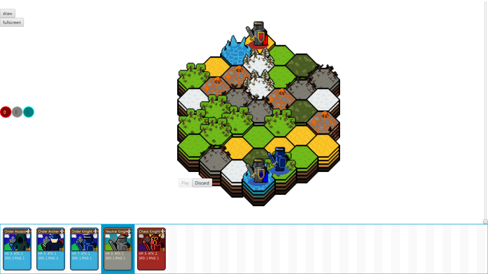
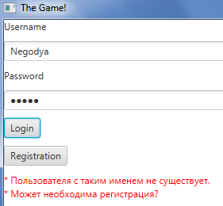

# Проект *Card Game*

Над проектом работали Егоров Максим и Колесников Алексей, студенты 2 курса группы МОА-205

## Исходный код проекта

[Server repository](https://github.com/L1oid/ServerProject)
[Client repository](https://github.com/Negodya1/JavaFXProject)

## Идея проекта

Идея очень проста. Мы просто захотели сделать игру рандомной тематики с реализацией CLIENT - SERVER, для того чтобы хотя бы немного понять - как устроены онлайн игры. Думаю у нас это получилось.

## Реализация проекта
#### Cервер:
В классе Main осуществляется подключение к БД, создание singleton-класса для хранения общей информации, а также создание двух потоков для соответственно двух игроков. В классе Netrwork происходит основная работа, в частности в методе work(), т.к. именно в этом методе прописанна основная логика подключения, регистрации, логина, обмена действий игроков и т.д. Также в Network реализованны методы inReadInt(), inReadString(), outWriteInt(), outWriteString() - которые отвечают за соответствующие действия - чтения или записи над соответствующими типами данных - String или Int. Ещё есть singleton-класс Info для хранения общей информации, а также Класс NewThread для создания потоков.

Ещё на сервере есть пакет database в котором присутствуют классы взаимодействия с базой данных. В них прописанны разные запросы к БД, такие как select, insert, update и т.д. Также в этом пакете реализован класс для подключения к БД.
#### Клиент:
Класс Controller отвечает за работу графического интерфейса клиента и логику игры
Основными классами игры являются классы Card, Unit и World

Класс Card отвечает за карты, которые могут разыгрывать игроки в течение партии, данный класс хранит в себе такие параметры, как: название карты, её описание, стоимость розыгрыша, масть, а также изображение карты и выполняемое ей действие.
Класс Card имеет подкласс Deck, который представляет собой колоду карт и соответствующий набор методов для взаимодействия с ней, например можно взять карту из колоды или перемешать карты в этой колоде

Класс Unit представляет собой войска, подконтрольные игрокам, содержит информацию об этих вайсках, например здоровье, сила атаки, скорость и т.д.

Класс World хранит в себе множество объектов подкласса Tile. Каждый отдельный Tile представляет собой небольшую область игрового мира, со своим характеристиками (высота, тип тайла, температура). Каждый раз мир генерируется из случайных тайлов, создавая уникальный внешний вид мира

## Библиотеки
#### Cервер:
Драйвер базы данных postgresql
#### Клиент:
JavaFX
## Скриншоты проекта

> **Примечание:** Функционал может быть немного расширен до финального релиза, а интерфейс быть немного изменён.
## Заключение
Колесников Алексей занимался реализацией сервера, к клиенту не прикасался вообще - этим занимался Максим Егоров. Поэтому Алексеем был реализована большая часть сервера(около 95%) - это подключение к БД, создание потоков, подключение, логин и регистрация пользователей, получение, отправка и обмен данными между игроками, выборка, изменение, заполнение данных в БД.
Максим Егоров ответственен за концепцию проекта, реализацию клиента и общение клиента с сервером. Также мною была нарисована графика для игры и было начато звуковое сопровождение игры (музыка и звуковые эффекты)

